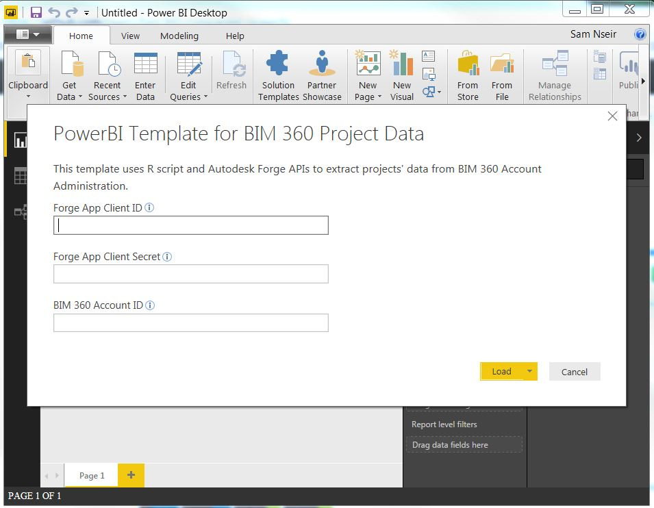
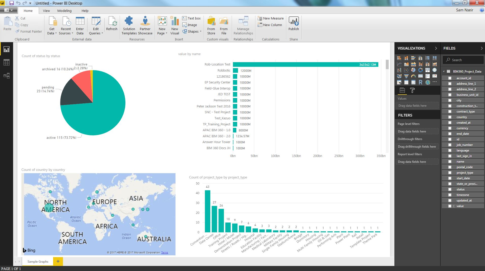

# bim360-projects-powerbi

R script that uses 2-legged OAuth and BIM 360 API to extract projects' data from [BIM 360 Account Administration](https://admin.b360.autodesk.com/login)

 

## Description

This is a sample code that shows how to use [R programming](https://www.r-project.org/) to extract projects' infromation from a [BIM 360 Account](https://admin.b360.autodesk.com/login). The output of this script is a [data frame](http://www.r-tutor.com/r-introduction/data-frame) that contains the project directory data from [BIM 360 Account](https://admin.b360.autodesk.com/login). A good way to use this script is by importing it as a [data source in Power BI Desktop](https://powerbi.microsoft.com/en-us/documentation/powerbi-desktop-data-sources/) to analyze BIM 360 data.

## Setup
#### 1. Create Autodesk Forge App.
* Visit the [Forge Developer Portal](https://developer.autodesk.com) and sign up for an account
* [Create an App](https://developer.autodesk.com/myapps/create). Callback URL is not being used by this script. When asked for the 'callback URL', you can use any URL
* Take note of the **Client ID** and **Client Secret**.

#### 2. Add Custom Integration to BIM 360 Account
* Log into your BIM 360 Account Admin site, https://admin.b360.autodesk.com/
* Go to “SETTINGS” tab then to “Custom Integrations” tab
* Click on “Add Custom Integration” button to register your app for this specific account.
* Take note of the **BIM 360 Account ID**.

#### 3. Setup R
* Install **[R](https://cran.r-project.org/mirrors.html)**:  Here is a guide on how to install R, http://rprogramming.net/how-to-install-r-fast/.
* Load **'httr'** and **'jsonlite'** packages: Here is a guide on how load packeges to R, https://www.statmethods.net/interface/packages.html.
* Install RStudio (optional): Here is a guide on how to download and install RStudio, http://rprogramming.net/download-and-install-rstudio/.

#### 4. Execute R script
Before executing the R script from the **Export BIM360 Project Data.R** file, input **Client ID**, **Client Secret**, and **BIM 360 Account ID** from steps 1 & 2 into lines **6**, **7**, and **8** of the script.

#### 5. Execute R script in Power BI Desktop (Optional)
* Install **PowerBI Desktop**: Download from https://powerbi.microsoft.com/desktop/
* Click on **Get Data** and select **R Script**
* Copy the R script from the **Export BIM360 Project Data.R** file and Paste in the Script box
* Input **Client ID**, **Client Secret**, and **BIM 360 Account ID** from steps 1 & 2 into lines **6**, **7**, and **8** of the script.
* Click Ok and select **BIM360_Project_Data** table to load it to PowerBI

## Power BI Template
To test how this R script works in Power BI, downlaod the following [PowerBI Template for BIM 360 Project Data.pbit](https://github.com/nseirs/bim360-projects-powerbi/blob/master/PowerBI%20Template%20for%20BIM%20360%20Project%20Data.pbit?raw=true)

To run this template, you need  **Client ID**, **Client Secret**, and **BIM 360 Account ID** from steps 1 & 2 in [**Setup**](#setup) and you need to setup R as per step 3 in [**Setup**](#setup).

The successful loading of the template should show results similar to this. 

## License

This sample is licensed under the terms of the [MIT License](http://opensource.org/licenses/MIT).
Please see the [LICENSE](LICENSE) file for full details.

## Written by

Sam Nseir, P.E. [@samnseirpe](https://www.linkedin.com/in/samnseirpe/)
